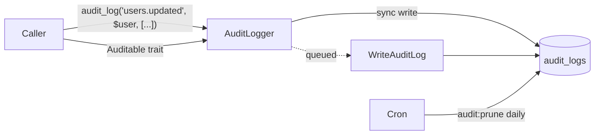

# Audit Trail

Append-only audit log module for domain and lifecycle events. Writes a row
to `audit_logs` describing who did what, on which entity, when, with what
payload — and rotates old rows out via a scheduled prune.

The module is non-fatal by design: when audit writes fail (DB down, schema
mismatch, queue offline) the failure is logged via Laravel's default logger
and `null` is returned. Business code is never interrupted.

## How It Works



Three ways to emit:

1. **Helper** — `audit_log('event.name', $model, ['metadata' => [...]])` for
   cross-cutting events (login, custom business actions).
2. **Auditable trait** — opt-in per model; auto-captures `created`,
   `updated`, `deleted` with the attribute diff.
3. **Service directly** — `app(AuditLogger::class)->log(...)` when you want
   the typed API or need to pass an explicit user.

## Defaults

| | |
|---|---|
| Module switch | enabled |
| Write mode | synchronous (`AUDIT_QUEUE=true` switches to queued) |
| Retention | 180 days, daily prune at 03:00 |
| Request context | captured (IP, user agent, `X-Request-Id`) |
| Sensitive keys redacted | `password`, `*_token`, `secret`, `authorization`, `api_key`, … |
| Allow-list | none (every event is recorded) |

## Configuration

`config/boilerplate.php → audit`:

```php
'audit' => [
    'enabled' => (bool) env('AUDIT_ENABLED', true),

    'connection' => env('AUDIT_DB_CONNECTION'),   // null = default
    'table' => 'audit_logs',

    'queue' => (bool) env('AUDIT_QUEUE', false),
    'queue_connection' => env('AUDIT_QUEUE_CONNECTION'),
    'queue_name' => env('AUDIT_QUEUE_NAME', 'default'),

    'capture_request_context' => (bool) env('AUDIT_CAPTURE_REQUEST_CONTEXT', true),

    'redact_keys' => ['password', 'token', 'secret', /* ... */],
    'events_allowlist' => null,   // null = allow all

    'prune' => [
        'enabled' => (bool) env('AUDIT_PRUNE_ENABLED', true),
        'days' => (int) env('AUDIT_PRUNE_DAYS', 180),
        'chunk_size' => (int) env('AUDIT_PRUNE_CHUNK_SIZE', 1000),
    ],
],
```

| Key | Effect |
|---|---|
| `enabled = false` | `AuditLogger::log()`, the `Auditable` trait, and `audit_log()` all return null. The table and command remain available. |
| `connection` | Send audit writes to a dedicated DB connection (recommended in high-volume systems). |
| `queue = true` | Writes go through the `WriteAuditLog` job. Requires a queue worker. |
| `capture_request_context` | Toggle automatic IP / UA / `X-Request-Id` capture. |
| `redact_keys` | Case-insensitive, recursive. Matching keys are replaced with `'[REDACTED]'` in `old_values`, `new_values`, and `metadata` before persistence. |
| `events_allowlist` | `null` = log everything. Provide an array of event names to restrict logging. |
| `prune.*` | Daily retention sweep. `chunk_size` controls how many rows are deleted per batch. |

## Helper Usage

```php
// Domain action with metadata only
audit_log('auth.login', $user, ['metadata' => ['method' => 'password']]);

// Mutation with diff
audit_log('users.email_changed', $user, [
    'old' => ['email' => 'old@example.com'],
    'new' => ['email' => 'new@example.com'],
]);

// Override the acting user (e.g. during a system job)
audit_log('billing.invoice_voided', $invoice, [
    'user' => $admin,
    'metadata' => ['reason' => 'refund'],
]);
```

The helper auto-resolves the acting user from the current request when
`payload.user` is omitted, falling back to the `sanctum` guard. Pass a
`User` instance or a ULID string to override.

## Auditable Trait

Add the trait to any Eloquent model to auto-capture create/update/delete:

```php
use App\Models\Concerns\Auditable;

class Order extends Model
{
    use Auditable;

    // Attributes to omit from the captured payload (in addition to the
    // built-in exclusions: created_at, updated_at, deleted_at, password,
    // remember_token).
    protected array $auditExclude = ['internal_notes'];
}
```

Generated event names follow `<snake_model>.<verb>`, e.g.
`order.created` / `order.updated` / `order.deleted`. Override
`auditEventName(string $verb): string` on the model to customize.

- `updated` only fires when at least one attribute is dirty — pure
  `->save()` calls produce no log row.
- `old_values` contains only the attributes that changed; `new_values`
  contains the same keys with the post-change values.
- Sensitive keys still flow through `redact_keys`, so leaving `password`
  in the model is safe — but excluding it via `$auditExclude` is cleaner.

## Service API

```php
use App\Services\Audit\AuditLogger;

$audit = app(AuditLogger::class);

$audit->log('auth.login', $user, [
    'metadata' => ['method' => 'password'],
]);

$audit->logModelChange(
    $user,
    'users.updated',
    old: ['name' => 'Old'],
    new: ['name' => 'New'],
    metadata: ['source' => 'admin'],
);

$audit->isEnabled(); // bool — honors config flag
```

Both methods return the persisted `AuditLog` on sync writes, or `null` in
queued mode / when disabled / on failure.

## Querying the Log

```php
use App\Models\AuditLog;

AuditLog::query()->forUser($user->id)->latest()->paginate(20);

AuditLog::query()->forEvent('auth.login')->between(now()->subDay(), now())->get();

// Polymorphic — get every entry attached to a specific record
AuditLog::query()
    ->where('auditable_type', $order->getMorphClass())
    ->where('auditable_id', $order->id)
    ->latest()
    ->get();

// Eager-load the actor
AuditLog::query()->with('user')->latest()->paginate(20);
```

## Pruning

```bash
php artisan audit:prune                # prune per config.days
php artisan audit:prune --days=30      # override retention window
php artisan audit:prune --dry-run      # report count without deleting
```

Scheduled daily at 03:00 via `routes/console.php` when
`audit.prune.enabled` is true. Deletes occur in `chunk_size` batches to
keep transaction footprint small.

## Schema

`audit_logs`:

| Column | Type | Notes |
|---|---|---|
| `id` | ULID | Primary key |
| `user_id` | nullable ULID | FK → users (null on delete). Null for system events. |
| `event` | string(100) | Dot-namespaced event name |
| `auditable_type`, `auditable_id` | nullable ULID morphs | Polymorphic target |
| `old_values` / `new_values` / `metadata` | json nullable | Redacted before insert |
| `ip_address` | string(45) | IPv6-capable |
| `user_agent` | string | Truncated to 1000 chars |
| `request_id` | string(64) | `X-Request-Id` header when present |
| `created_at` | timestamp | **immutable — no `updated_at`** |

Indexes:

- `idx_audit_logs__user_id_created_at`
- `idx_audit_logs__event_created_at`
- `idx_audit_logs__created_at`
- `idx_audit_logs__auditable` (polymorphic)

## Event Naming Convention

Use `<domain>.<verb>` in lowercase snake_case:

- `auth.login`, `auth.logout`, `auth.password_reset`
- `users.created`, `users.email_changed`, `users.deleted`
- `files.uploaded`, `files.claimed`, `files.deleted`
- `billing.invoice_paid`, `billing.refund_issued`

The Auditable trait synthesizes names automatically; the helper / service
APIs let you pick whatever name fits the domain.

## Customizing

| What | How |
|---|---|
| Dedicated DB | Define a connection in `config/database.php`, then set `AUDIT_DB_CONNECTION`. |
| Tighten capture surface | Set `events_allowlist` to an array of exact event names. |
| Mask additional keys | Append to `audit.redact_keys` in config. |
| Different event names per model | Override `auditEventName(string $verb)` on the model. |
| Add searchable JSON fields | Add Postgres GIN / MySQL functional indexes on `metadata`/`old_values`/`new_values` in a follow-up migration. |
| Expose to admins | Build a `Admin\AuditLogController` returning paginated `AuditLog::query()` results. The model + scopes are ready; controllers are intentionally out of scope so each project can pick its admin UI / authorization story. |

## Key Files

| File | Purpose |
|---|---|
| `config/boilerplate.php → audit` | Defaults and toggles. |
| `app/Models/AuditLog.php` | Eloquent model, scopes, polymorphic relation. |
| `app/Models/Concerns/Auditable.php` | Opt-in trait — booted observer for create/update/delete. |
| `app/Services/Audit/AuditLogger.php` | Core write path with redaction, context capture, queue routing. |
| `app/Jobs/Audit/WriteAuditLog.php` | Queued write job (used when `audit.queue = true`). |
| `app/Support/helpers.php` | Global `audit_log()` helper. |
| `app/Console/Commands/PruneAuditLogs.php` | `audit:prune` artisan command. |
| `app/Providers/AuditServiceProvider.php` | Binds `AuditLogger` as singleton. |
| `database/migrations/*_create_audit_logs_table.php` | Schema. |
| `routes/console.php` | Daily prune schedule. |
| `tests/Feature/Audit/*` | Logger, trait, helper, prune coverage. |
