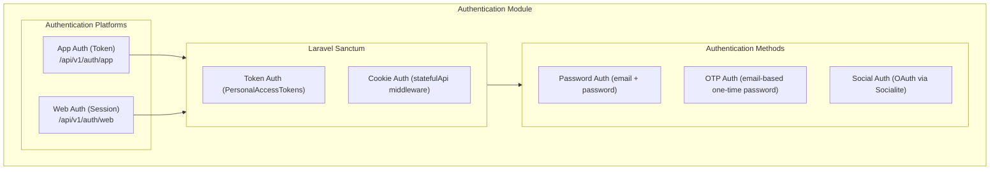
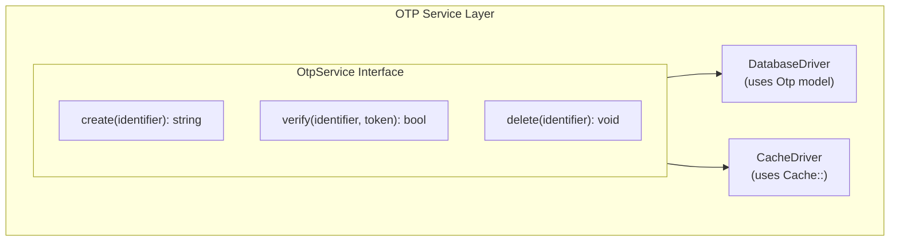
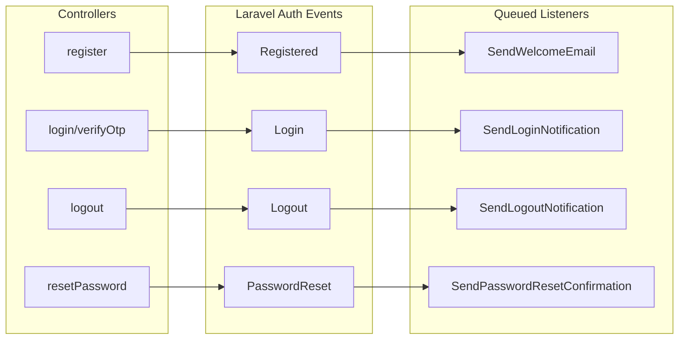

# Authentication Module

This document describes the authentication architecture and usage for the Laravel API Boilerplate.

## Overview

The boilerplate implements a **dual authentication system** using Laravel Sanctum to support both:

- **App Authentication** (Token-based): For native mobile/desktop applications
- **Web Authentication** (Session-based): For Single Page Applications (SPA)

Both platforms support multiple authentication methods:
- Password-based authentication (register, login)
- OTP passwordless authentication (email-based one-time passwords)
- Social authentication via OAuth (Google, GitHub, Facebook, Twitter)

## Architecture



## Configuration

All authentication settings are centralized in `config/boilerplate.php`:

```php
'auth' => [
    // Authentication methods toggle
    'password_auth_enabled' => true,
    'otp_auth_enabled' => true,

    // OTP settings
    'otp_length' => 6,
    'otp_expiry_minutes' => 10,
    'otp_driver' => env('OTP_DRIVER', 'database'), // 'database' or 'cache'
    'otp_cache_store' => env('OTP_CACHE_STORE'),   // cache store when using 'cache' driver

    // Password reset settings
    'password_reset_expiry_minutes' => 60,

    // Password requirements
    'password_min_length' => 8,

    // Frontend URLs for password reset emails
    'frontend_url' => env('FRONTEND_URL', 'http://localhost:3000'),
    'password_reset_url' => env('PASSWORD_RESET_URL', '/reset-password'),

    // Socialite settings
    'socialite_enabled' => env('SOCIALITE_ENABLED', true),
    'socialite_providers' => [
        'google' => env('SOCIALITE_GOOGLE_ENABLED', false),
        'github' => env('SOCIALITE_GITHUB_ENABLED', false),
        'facebook' => env('SOCIALITE_FACEBOOK_ENABLED', false),
        'twitter' => env('SOCIALITE_TWITTER_ENABLED', false),
    ],
    'socialite_callback_url' => env('SOCIALITE_CALLBACK_URL', 'http://localhost:3000/auth/callback'),
],
```

## OTP Driver Configuration

The OTP (One-Time Password) system supports two storage drivers:

### Database Driver (Default)
Stores OTPs in the `otps` database table. Best for:
- Simple deployments without Redis
- When you need to query OTP records
- Development environments

```bash
OTP_DRIVER=database
```

### Cache Driver
Stores OTPs in Laravel's cache system (Redis, Memcached, etc.). Best for:
- High-performance production environments
- When you already have Redis configured
- Automatic TTL-based expiration (no cleanup needed)

```bash
OTP_DRIVER=cache
OTP_CACHE_STORE=redis
```

### Architecture



### Key Files

| File | Purpose |
|------|---------|
| `app/Services/Otp/Contracts/OtpService.php` | Service interface |
| `app/Services/Otp/DatabaseDriver.php` | Database storage driver |
| `app/Services/Otp/CacheDriver.php` | Cache storage driver |
| `app/Providers/OtpServiceProvider.php` | Driver binding |

## Route Structure

### App Authentication (Token-based)

| Method | Endpoint | Description | Auth |
|--------|----------|-------------|------|
| POST | `/api/v1/auth/app/register` | Register new user | No |
| POST | `/api/v1/auth/app/login` | Login with password | No |
| POST | `/api/v1/auth/app/otp` | Request OTP | No |
| POST | `/api/v1/auth/app/otp/verify` | Verify OTP | No |
| POST | `/api/v1/auth/app/forgot-password` | Request password reset | No |
| POST | `/api/v1/auth/app/reset-password` | Reset password | No |
| POST | `/api/v1/auth/app/logout` | Revoke token | Yes |
| POST | `/api/v1/auth/app/change-password` | Change password | Yes |

### Web Authentication (Session-based)

| Method | Endpoint | Description | Auth |
|--------|----------|-------------|------|
| POST | `/api/v1/auth/web/register` | Register new user | No |
| POST | `/api/v1/auth/web/login` | Login with password | No |
| POST | `/api/v1/auth/web/otp` | Request OTP | No |
| POST | `/api/v1/auth/web/otp/verify` | Verify OTP | No |
| POST | `/api/v1/auth/web/forgot-password` | Request password reset | No |
| POST | `/api/v1/auth/web/reset-password` | Reset password | No |
| POST | `/api/v1/auth/web/logout` | Destroy session | Yes |
| POST | `/api/v1/auth/web/change-password` | Change password | Yes |

### Social Authentication (OAuth)

Available for both `/auth/app` and `/auth/web`:

| Method | Endpoint | Description | Auth |
|--------|----------|-------------|------|
| POST | `/social/{provider}/redirect` | Get OAuth redirect URL | No |
| POST | `/social/{provider}/callback` | Handle OAuth callback | No |
| GET | `/social/accounts` | List linked accounts | Yes |
| POST | `/social/{provider}/link` | Start linking flow | Yes |
| POST | `/social/{provider}/link/callback` | Complete linking | Yes |
| DELETE | `/social/{provider}/unlink` | Unlink account | Yes |

### Shared Endpoints

| Method | Endpoint | Description | Auth |
|--------|----------|-------------|------|
| GET | `/api/v1/me` | Get authenticated user | Yes |

## Usage Examples

### App Authentication (Token-based)

#### Register
```bash
curl -X POST http://localhost/api/v1/auth/app/register \
  -H "Content-Type: application/json" \
  -d '{
    "name": "John Doe",
    "email": "john@example.com",
    "password": "password123",
    "password_confirmation": "password123"
  }'
```

Response:
```json
{
  "data": {
    "access_token": "1|abc123...",
    "token_type": "Bearer",
    "user": {
      "id": 1,
      "name": "John Doe",
      "email": "john@example.com"
    }
  }
}
```

#### Login
```bash
curl -X POST http://localhost/api/v1/auth/app/login \
  -H "Content-Type: application/json" \
  -d '{
    "email": "john@example.com",
    "password": "password123",
    "device_name": "iPhone 15 Pro"
  }'
```

#### Using the Token
```bash
curl http://localhost/api/v1/me \
  -H "Authorization: Bearer 1|abc123..."
```

### Web Authentication (Session-based)

For SPA applications, ensure you:
1. Include credentials in requests
2. Set the appropriate CORS configuration
3. Handle CSRF tokens if needed

```javascript
// Login
const response = await fetch('/api/v1/auth/web/login', {
  method: 'POST',
  credentials: 'include',
  headers: { 'Content-Type': 'application/json' },
  body: JSON.stringify({
    email: 'john@example.com',
    password: 'password123'
  })
});

// Subsequent requests (session cookie is automatically included)
const user = await fetch('/api/v1/me', {
  credentials: 'include'
});
```

### OTP Authentication

#### Request OTP
```bash
curl -X POST http://localhost/api/v1/auth/app/otp \
  -H "Content-Type: application/json" \
  -d '{"email": "john@example.com"}'
```

#### Verify OTP
```bash
curl -X POST http://localhost/api/v1/auth/app/otp/verify \
  -H "Content-Type: application/json" \
  -d '{
    "email": "john@example.com",
    "token": "123456",
    "device_name": "My Device"
  }'
```

### Social Authentication (OAuth)

#### OAuth Flow

1. **Get Redirect URL**
```bash
curl -X POST http://localhost/api/v1/auth/app/social/github/redirect
```

Response:
```json
{
  "data": {
    "redirect_url": "https://github.com/login/oauth/authorize?client_id=..."
  }
}
```

2. **Open the URL in browser/webview** - User authorizes the app

3. **Handle Callback** - After authorization, the provider redirects to your frontend callback URL with a `code` parameter

4. **Exchange Code for Token**
```bash
curl -X POST http://localhost/api/v1/auth/app/social/github/callback \
  -H "Content-Type: application/json" \
  -d '{
    "code": "authorization_code_from_provider",
    "device_name": "My Device"
  }'
```

#### Link Social Account (Authenticated)

```bash
# 1. Get redirect URL
curl -X POST http://localhost/api/v1/auth/app/social/github/link \
  -H "Authorization: Bearer your-token"

# 2. After OAuth, complete linking
curl -X POST http://localhost/api/v1/auth/app/social/github/link/callback \
  -H "Authorization: Bearer your-token" \
  -H "Content-Type: application/json" \
  -d '{"code": "authorization_code"}'
```

#### Unlink Social Account

```bash
curl -X DELETE http://localhost/api/v1/auth/app/social/github/unlink \
  -H "Authorization: Bearer your-token"
```

## Environment Variables

Add these to your `.env` file:

```bash
# Frontend URL
FRONTEND_URL=http://localhost:3000

# OTP Driver ('database' or 'cache')
OTP_DRIVER=database
# OTP_CACHE_STORE=redis

# Socialite
SOCIALITE_ENABLED=true
SOCIALITE_CALLBACK_URL=http://localhost:3000/auth/callback

# Google OAuth
SOCIALITE_GOOGLE_ENABLED=true
GOOGLE_CLIENT_ID=your-client-id
GOOGLE_CLIENT_SECRET=your-client-secret
GOOGLE_REDIRECT_URI=http://localhost:3000/auth/callback/google

# GitHub OAuth
SOCIALITE_GITHUB_ENABLED=true
GITHUB_CLIENT_ID=your-client-id
GITHUB_CLIENT_SECRET=your-client-secret
GITHUB_REDIRECT_URI=http://localhost:3000/auth/callback/github

# Facebook OAuth
SOCIALITE_FACEBOOK_ENABLED=false
FACEBOOK_CLIENT_ID=
FACEBOOK_CLIENT_SECRET=
FACEBOOK_REDIRECT_URI=

# Twitter OAuth
SOCIALITE_TWITTER_ENABLED=false
TWITTER_CLIENT_ID=
TWITTER_CLIENT_SECRET=
TWITTER_REDIRECT_URI=
```

## Database Schema

### Users Table

| Column | Type | Description |
|--------|------|-------------|
| id | bigint | Primary key |
| name | string | User's display name |
| email | string | Unique email address |
| email_verified_at | timestamp | Email verification timestamp |
| password | string | Hashed password |
| avatar_url | string | Profile avatar URL |
| is_active | boolean | Account active status |
| last_login_at | timestamp | Last login timestamp |
| remember_token | string | Remember me token |
| created_at | timestamp | Creation timestamp |
| updated_at | timestamp | Last update timestamp |

### Social Accounts Table

| Column | Type | Description |
|--------|------|-------------|
| id | bigint | Primary key |
| user_id | bigint | Foreign key to users |
| provider | string | Provider name (google, github, etc.) |
| provider_id | string | Unique ID from provider |
| provider_email | string | Email from provider |
| name | string | Display name from provider |
| avatar | string | Avatar URL from provider |
| access_token | text | Encrypted OAuth access token |
| refresh_token | text | Encrypted OAuth refresh token |
| token_expires_at | timestamp | Token expiration time |
| created_at | timestamp | Creation timestamp |
| updated_at | timestamp | Last update timestamp |

### OTPs Table

| Column | Type | Description |
|--------|------|-------------|
| id | bigint | Primary key |
| identifier | string | Email address |
| token | string | 6-digit OTP code |
| expires_at | timestamp | Expiration time |
| created_at | timestamp | Creation timestamp |
| updated_at | timestamp | Last update timestamp |

## Security Considerations

1. **Password Hashing**: All passwords are hashed using bcrypt
2. **Token Security**: Sanctum tokens are hashed in the database
3. **OTP Expiry**: OTPs expire after 10 minutes (configurable)
4. **OTP Cleanup**: OTPs are deleted after successful verification
5. **OAuth Token Encryption**: Social account tokens are encrypted at rest
6. **Account Linking**: Auto-links accounts with matching email addresses
7. **Inactive Accounts**: Login is blocked for users with `is_active = false`
8. **Rate Limiting**: Consider adding rate limits to auth endpoints

## Events & Notifications

The authentication module uses Laravel's built-in event system to send email notifications for key authentication events.

### Supported Events

| Event | Listener | Email Sent |
|-------|----------|------------|
| `Illuminate\Auth\Events\Registered` | `SendWelcomeEmail` | Welcome email to new users |
| `Illuminate\Auth\Events\Login` | `SendLoginNotification` | Login alert notification |
| `Illuminate\Auth\Events\Logout` | `SendLogoutNotification` | Logout notification |
| `Illuminate\Auth\Events\PasswordReset` | `SendPasswordResetConfirmation` | Password reset confirmation |

### Configuration

All notifications can be toggled via `config/boilerplate.php`:

```php
'auth' => [
    // ...

    'notifications' => [
        'welcome_email_enabled' => env('AUTH_WELCOME_EMAIL_ENABLED', true),
        'login_notification_enabled' => env('AUTH_LOGIN_NOTIFICATION_ENABLED', true),
        'logout_notification_enabled' => env('AUTH_LOGOUT_NOTIFICATION_ENABLED', false),
        'password_reset_confirmation_enabled' => env('AUTH_PASSWORD_RESET_CONFIRMATION_ENABLED', true),
    ],
],
```

### Environment Variables

```bash
# Auth Event Notifications
AUTH_WELCOME_EMAIL_ENABLED=true
AUTH_LOGIN_NOTIFICATION_ENABLED=true
AUTH_LOGOUT_NOTIFICATION_ENABLED=false
AUTH_PASSWORD_RESET_CONFIRMATION_ENABLED=true
```

### Event Flow



### Key Points

1. **Queued Listeners**: All listeners implement `ShouldQueue` for async processing
2. **Event Discovery**: Laravel 12 automatically discovers listeners in `app/Listeners/`
3. **Config Checks**: Each listener checks config before sending
4. **OTP New Users**: OTP verification dispatches `Registered` for new users, then `Login`

### Customizing Email Templates

Email templates are located in `resources/views/emails/`:

| Template | Description |
|----------|-------------|
| `welcome.blade.php` | Welcome email for new users |
| `login-notification.blade.php` | Login alert notification |
| `logout-notification.blade.php` | Logout notification |
| `password-reset-confirmation.blade.php` | Password reset confirmation |

## Key Files

| File | Purpose |
|------|---------|
| `config/boilerplate.php` | Authentication configuration |
| `app/Http/Controllers/Api/Auth/AppAuthController.php` | Token-based auth |
| `app/Http/Controllers/Api/Auth/WebAuthController.php` | Session-based auth |
| `app/Http/Controllers/Api/Auth/AppSocialAuthController.php` | Token-based social auth |
| `app/Http/Controllers/Api/Auth/WebSocialAuthController.php` | Session-based social auth |
| `app/Http/Controllers/Api/Auth/SharedAuthController.php` | Shared endpoints |
| `app/Models/User.php` | User model |
| `app/Models/SocialAccount.php` | Social account model |
| `app/Models/Otp.php` | OTP model (database driver) |
| `app/Services/Otp/Contracts/OtpService.php` | OTP service interface |
| `app/Services/Otp/DatabaseDriver.php` | OTP database driver |
| `app/Services/Otp/CacheDriver.php` | OTP cache driver |
| `app/Listeners/SendWelcomeEmail.php` | Welcome email listener |
| `app/Listeners/SendLoginNotification.php` | Login notification listener |
| `app/Listeners/SendLogoutNotification.php` | Logout notification listener |
| `app/Listeners/SendPasswordResetConfirmation.php` | Password reset listener |
| `routes/api.php` | API routes |

## Extending the Module

### Adding a New OAuth Provider

1. Enable the provider in `config/boilerplate.php`:
```php
'socialite_providers' => [
    // ...
    'linkedin' => env('SOCIALITE_LINKEDIN_ENABLED', false),
],
```

2. Add credentials in `config/services.php`:
```php
'linkedin' => [
    'client_id' => env('LINKEDIN_CLIENT_ID'),
    'client_secret' => env('LINKEDIN_CLIENT_SECRET'),
    'redirect' => env('LINKEDIN_REDIRECT_URI'),
],
```

3. Set environment variables in `.env`

### Customizing User Creation

Override the `findOrCreateUser` method in the `HandlesSocialiteAuth` trait or create a custom service class.

### Adding Custom Validation

Create custom form request classes in `app/Http/Requests/Auth/` following the existing patterns.
