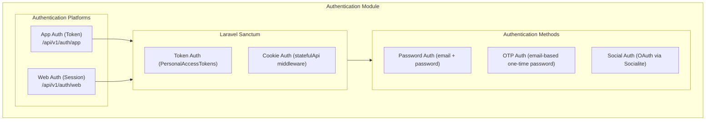

# Authentication Overview

This is the high-level map of the authentication module. Each sub-feature has its own dedicated doc — start here for the architecture and route layout, then drill in.

## Sub-Feature Docs

| Topic | Doc |
|---|---|
| OTP / passwordless | [otp.md](otp.md) |
| Social / OAuth | [social-auth.md](social-auth.md) |
| Email verification | [email-verification.md](email-verification.md) |
| Password policy | [password-policy.md](password-policy.md) |
| Rate limiting | [rate-limiting.md](rate-limiting.md) |
| RBAC (roles & permissions) | [rbac.md](rbac.md) |
| Auth event emails | [notifications.md](notifications.md) |
| Response envelope & errors | [api-responses.md](api-responses.md) |

## Dual Authentication

Two route trees share controllers and config but issue different credentials:

- **App** — `/api/v1/auth/app/*` — Sanctum bearer tokens for native mobile/desktop clients.
- **Web** — `/api/v1/auth/web/*` — Sanctum cookie/session for browser SPAs (`statefulApi()` middleware).

Both expose the same operations: register, login, password OTP, password reset, change password, OAuth, logout.

## Architecture



## Configuration

All auth knobs live under `auth` in `config/boilerplate.php`. Sub-feature settings (rate limits, password rules, email verification, OAuth providers, OTP driver, notifications) are documented in their respective files. The auth-section overview:

```php
'auth' => [
    'password_auth_enabled' => true,
    'otp_auth_enabled' => true,

    // OTP                  — see otp.md
    // password             — see password-policy.md
    // email_verification   — see email-verification.md
    // rate_limit           — see rate-limiting.md
    // notifications        — see notifications.md

    'frontend_url' => env('FRONTEND_URL', 'http://localhost:3000'),
    'password_reset_url' => env('PASSWORD_RESET_URL', '/reset-password'),
    'password_reset_expiry_minutes' => 60,

    'socialite_enabled' => env('SOCIALITE_ENABLED', true),
    'socialite_providers' => [...],
    'socialite_callback_url' => env('SOCIALITE_CALLBACK_URL', 'http://localhost:3000/auth/callback'),
],
```

## Route Reference

### App Authentication (Token-based)

| Method | Endpoint | Description | Auth |
|---|---|---|---|
| POST | `/api/v1/auth/app/register` | Register new user | No |
| POST | `/api/v1/auth/app/login` | Login with password | No |
| POST | `/api/v1/auth/app/otp` | Request OTP | No |
| POST | `/api/v1/auth/app/otp/verify` | Verify OTP | No |
| POST | `/api/v1/auth/app/forgot-password` | Request password reset | No |
| POST | `/api/v1/auth/app/reset-password` | Reset password | No |
| POST | `/api/v1/auth/app/logout` | Revoke token | Yes |
| POST | `/api/v1/auth/app/change-password` | Change password | Yes |

### Web Authentication (Session-based)

Same as App with `/auth/web/*` instead of `/auth/app/*`. Logout destroys the session instead of revoking a token.

### Social Authentication (OAuth)

Available under both `/auth/app/social/*` and `/auth/web/social/*` — see [social-auth.md](social-auth.md) for endpoint table and flow.

### Email Verification (Shared)

| Method | Endpoint | Description | Auth |
|---|---|---|---|
| GET | `/api/v1/auth/email/verify/{id}/{hash}` | Verify email | Signed URL |
| POST | `/api/v1/auth/email/verification-notification` | Resend verification | Yes |

See [email-verification.md](email-verification.md).

### Shared

| Method | Endpoint | Description | Auth |
|---|---|---|---|
| GET | `/api/v1/me` | Get authenticated user | Yes |

## Password Auth Usage

### Register

```bash
curl -X POST http://localhost/api/v1/auth/app/register \
  -H "Content-Type: application/json" \
  -d '{
    "name": "John Doe",
    "email": "john@example.com",
    "password": "Password123",
    "password_confirmation": "Password123"
  }'
```

```json
{
  "data": {
    "access_token": "1|abc123...",
    "token_type": "Bearer",
    "user": { "id": 1, "name": "John Doe", "email": "john@example.com" }
  }
}
```

(Password requirements come from [password-policy.md](password-policy.md).)

### Login

```bash
curl -X POST http://localhost/api/v1/auth/app/login \
  -H "Content-Type: application/json" \
  -d '{
    "email": "john@example.com",
    "password": "Password123",
    "device_name": "iPhone 15 Pro"
  }'
```

### Authenticated Request

```bash
curl http://localhost/api/v1/me \
  -H "Authorization: Bearer 1|abc123..."
```

### Web (SPA) Login

```javascript
await fetch('/api/v1/auth/web/login', {
  method: 'POST',
  credentials: 'include',
  headers: { 'Content-Type': 'application/json' },
  body: JSON.stringify({ email: 'john@example.com', password: 'Password123' }),
});

// Subsequent requests include the session cookie automatically.
const me = await fetch('/api/v1/me', { credentials: 'include' });
```

## Database Schema

### Users
| Column | Type | Notes |
|---|---|---|
| id | bigint | Primary key |
| name | string | |
| email | string | Unique |
| email_verified_at | timestamp nullable | Set by email verification or OTP login |
| password | string | Hashed (bcrypt) |
| avatar_url | string nullable | |
| is_active | boolean | Inactive accounts can't log in |
| last_login_at | timestamp nullable | Updated on every login |
| remember_token | string | |
| timestamps | | |

### Social Accounts
See [social-auth.md](social-auth.md).

### OTPs
See [otp.md](otp.md).

## Security Considerations

| Concern | How it's addressed |
|---|---|
| Password storage | Bcrypt hashing via Eloquent's `hashed` cast |
| Sanctum tokens | Hashed in DB |
| OTP TTL | Configurable, default 10 minutes |
| OTP cleanup | Deleted on successful verify |
| OAuth tokens | Encrypted at rest |
| Auto account-link by email | Enabled — see [social-auth.md](social-auth.md) for the threat-model trade-off |
| Inactive accounts | Login blocked when `is_active = false` |
| Brute-force protection | Per-endpoint throttles — see [rate-limiting.md](rate-limiting.md) |
| Weak passwords | `Password::defaults()` chain — see [password-policy.md](password-policy.md) |
| Email ownership | [email-verification.md](email-verification.md) — required-for-login is a config flag |
| Authorization | RBAC roles + permissions — see [rbac.md](rbac.md) |

## Key Files

| File | Purpose |
|---|---|
| `config/boilerplate.php` | Auth configuration |
| `app/Http/Controllers/Api/Auth/AppAuthController.php` | Token-based auth |
| `app/Http/Controllers/Api/Auth/WebAuthController.php` | Session-based auth |
| `app/Http/Controllers/Api/Auth/SharedAuthController.php` | Shared (`/me`) |
| `app/Http/Controllers/Api/Auth/EmailVerificationController.php` | Verify + resend (see [email-verification.md](email-verification.md)) |
| `app/Http/Controllers/Api/Auth/{App,Web}SocialAuthController.php` | OAuth (see [social-auth.md](social-auth.md)) |
| `app/Models/User.php` | User model — implements `MustVerifyEmail` |
| `routes/api.php` | All auth routes |

## Customizing User Creation

Override `findOrCreateUser` in `App\Http\Controllers\Api\Auth\Concerns\HandlesSocialiteAuth` (for OAuth) or extend the `register()` controller methods directly.

## Custom Validation

Form requests live in `app/Http/Requests/Auth/`. Follow the existing patterns (`authorize()` + `rules()` + `messages()`).
