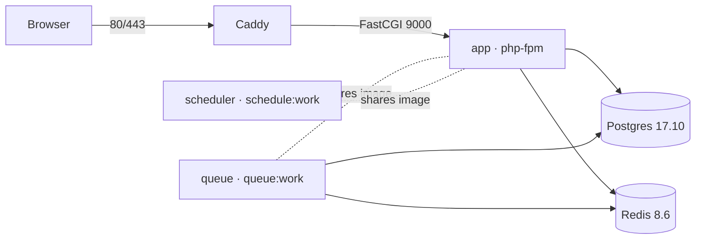

# Docker

The application ships with a dockerised stack for both local development and
production. The image itself is role-agnostic — every container runs the same
binary, and the compose file is the single source of truth for what each
container actually does.

## Topology



| Service | Image | Role |
|---|---|---|
| `caddy` | `caddy:2-alpine` | Web server; auto-TLS in prod, plain HTTP in dev |
| `app` | `${APP_IMAGE}:${APP_IMAGE_TAG}` | PHP-FPM listening on `:9000` |
| `queue` | same | `php artisan queue:work` |
| `scheduler` | same | `php artisan schedule:work` (replaces host cron) |
| `db` | `postgres:17.10-alpine` | Primary datastore |
| `redis` | `redis:8.6-alpine` | Cache, session, queue backend |

## Image Layout

`docker/Dockerfile` is multi-stage:

| Stage | Purpose |
|---|---|
| `vendor` | `composer install --no-dev` for the prod vendor tree |
| `assets` | `npm run build` to populate `public/build` |
| `base` | PHP-FPM 8.4 with extensions (`pdo_pgsql`, `redis`, `opcache`, `intl`, …) and the entrypoint |
| `dev` | Adds Xdebug (off by default) and re-uses host bind mount at runtime |
| `prod` | Bakes app + vendor + built assets, runs `composer dump-autoload --optimize`, switches to `www-data` |

### Entrypoint

`docker/entrypoint/app.sh` is the **shared** entrypoint baked into every
image. It performs role-independent bootstrap and then exec's whatever the
compose `command:` requested:

```bash
mkdir -p storage/{framework/...,logs} bootstrap/cache
[ APP_ENV=production ]  && php artisan {config,route,view,event}:cache
[ RUN_MIGRATIONS = 1 ]  && php artisan migrate --force
exec "$@"
```

`RUN_MIGRATIONS=1` is only set on the `app` service — `queue` and
`scheduler` are pinned to `0` in compose so workers never race the schema.

## Files

```
docker/
├── Dockerfile                     # multi-stage build (vendor / assets / base / dev / prod)
├── docker-compose.prod.yml        # production stack
├── .env.docker.example            # local compose variables
├── .env.prod.example              # production compose + Laravel variables
├── caddy/
│   ├── Caddyfile.dev              # HTTP only on :80
│   └── Caddyfile.prod             # auto-TLS for ${APP_DOMAIN}
├── php/
│   ├── php.ini                    # shared overrides (memory, upload size, timezone)
│   ├── opcache.ini                # prod OPcache + JIT
│   ├── www.conf                   # PHP-FPM pool tuning
│   └── xdebug.ini                 # dev only, opt-in via XDEBUG_MODE
└── entrypoint/
    └── app.sh                     # shared bootstrap + exec "$@"

docker-compose.yml                 # dev stack at the project root
Makefile                           # task runner
.dockerignore                      # build context filter
```

## Local Development

### Quick start

```bash
cp .env.example .env
cp docker/.env.docker.example docker/.env.docker

make up                # build dev image, start caddy + app + db + redis + queue + scheduler
make migrate           # first time only
```

App is reachable at `http://localhost:${CADDY_HTTP_PORT:-8080}`.

### Useful targets

| Target | Action |
|---|---|
| `make up` / `make down` | Start / stop the stack |
| `make ps` / `make logs` | Status, tail logs |
| `make sh` | Shell into the `app` container |
| `make tinker` | `php artisan tinker` inside the container |
| `make migrate` / `make migrate-fresh` | Run migrations (fresh re-seeds too) |
| `make test` | PHPUnit suite inside the container |
| `make pint` | Run Pint formatter on dirty files |
| `make restart` | Restart `app` + `caddy` only |

### Bind mount

`/var/www/html` inside dev containers is a bind mount of the project root —
edits on the host are picked up immediately by PHP-FPM. `WWW_USER_ID` and
`WWW_GROUP_ID` in `docker/.env.docker` are baked into the image at build
time; set them to your host `id -u` / `id -g` to avoid file-ownership
issues. Defaults to `1000`.

### Xdebug

Off by default to keep request latency low. To turn it on for a session:

```bash
XDEBUG_MODE=debug,develop make restart
```

Listen on host port `9003`. The image uses `host.docker.internal` to reach
your IDE, which works out of the box on Docker Desktop (macOS / Windows).
On Linux, set `--add-host=host.docker.internal:host-gateway` in compose or
use your host LAN IP.

## Production

### Build & push from CI / dev

A multi-arch image (linux/amd64 + linux/arm64) cannot be `--load`ed back
into the local docker store — buildx only supports that for single-platform
builds. So:

| Target | What it does |
|---|---|
| `make build` | Multi-arch build into the buildx cache. No artifact is produced locally — useful in CI to validate the build. |
| `make push` | Multi-arch build + push to the registry at `${APP_IMAGE}:${APP_IMAGE_TAG}`. **This is what produces a deployable artifact.** |
| `make build-local` | Single-arch build for the host platform, loaded into local docker. Use this if you want to `docker run` the prod image manually. |

```bash
# From a dev machine or CI
APP_IMAGE=ghcr.io/your-org/laravel-api-boilerplate APP_IMAGE_TAG=2026.05.14 make push
```

### Deploy on the server

`docker/docker-compose.prod.yml` only references `image:` — the server never
builds. The deploy loop is:

```bash
# On the server, first time:
git clone <repo>
cd <repo>
cp docker/.env.prod.example docker/.env.prod
# Edit docker/.env.prod with real APP_KEY, APP_DOMAIN, DB_PASSWORD, REDIS_PASSWORD, …

# Each release:
git pull                # refresh compose / Caddyfile / .env.prod
make prod-pull          # docker compose pull
make prod-up            # docker compose up -d (recreates changed services)
```

| Target | Action |
|---|---|
| `make prod-pull` | Pull the image referenced by `APP_IMAGE:APP_IMAGE_TAG` |
| `make prod-up` | Start or upgrade the stack |
| `make prod-down` | Stop everything |
| `make prod-logs` | Tail logs |

### Auto-TLS

Caddy reads `${APP_DOMAIN}` from `docker/.env.prod` and provisions a Let's
Encrypt certificate the first time it boots. Make sure DNS for that domain
points at the server and ports 80 + 443 are reachable. Issued certificates
persist in the `caddy_data` volume across restarts.

Already behind a TLS-terminating proxy (ALB, Cloudflare, …)? Replace
`docker/caddy/Caddyfile.prod` with a plain `:80` block — Caddy won't try to
issue a certificate when no public address is given.

### Migrations

`app` runs `php artisan migrate --force` on every boot when
`RUN_MIGRATIONS=1` (the default in `.env.prod.example`). For zero-downtime
schemas where you want migrations to run *before* swapping containers, set
`RUN_MIGRATIONS=0` and run them as a one-shot:

```bash
$(make -n prod-up | head -1 | sed 's/up -d/run --rm app php artisan migrate --force/')
```

(or just `docker compose --env-file docker/.env.prod -f docker/docker-compose.prod.yml run --rm app php artisan migrate --force`).

## Environment Files

Three env files cooperate, loaded in this order so later layers win:

| File | Read by | Holds |
|---|---|---|
| `.env` | Laravel app + dev compose | App-level config: `APP_KEY`, mail, third-party API keys |
| `docker/.env.docker` | Dev compose only | UID/GID, exposed ports, dev DB/Redis credentials, queue tuning |
| `docker/.env.prod` | Prod compose + Laravel | Everything in `.env` + image coordinates, `APP_DOMAIN`, `ACME_EMAIL` |

Both `docker/.env.docker` and `docker/.env.prod` are in `.gitignore`. Commit
only the `*.example` siblings.

## Customising

| What | How |
|---|---|
| Bump PHP version | Change `FROM php:8.4-fpm-alpine` in `docker/Dockerfile`. |
| Add a PHP extension | Append to the `docker-php-ext-install` list in the `base` stage. |
| Change PHP-FPM concurrency | Edit `docker/php/www.conf` (`pm.max_children`, etc.). |
| Add a service (e.g. Meilisearch) | Add to `docker-compose.yml` and `docker/docker-compose.prod.yml`; share the `app` network. |
| Multiple queue workers | Duplicate the `queue` service with different `command:` queue names, or set `--queue=high,default` and scale via `docker compose up -d --scale queue=N`. |
| Skip auto-migrate on deploy | Set `RUN_MIGRATIONS=0` in `docker/.env.prod`; run as a one-shot before `make prod-up`. |
| Use managed Postgres / Redis | Remove the `db` / `redis` services from `docker/docker-compose.prod.yml`; point `DB_HOST` / `REDIS_HOST` at the managed endpoint. |
| Run behind an existing TLS proxy | Replace `Caddyfile.prod` with a `:80` site block; remove the `:443` port mapping. |

## Key Files

| File | Purpose |
|---|---|
| `docker/Dockerfile` | Multi-stage build (`vendor`, `assets`, `base`, `dev`, `prod`). |
| `docker/entrypoint/app.sh` | Shared bootstrap, then `exec "$@"`. |
| `docker/caddy/Caddyfile.dev` | Local HTTP web server config. |
| `docker/caddy/Caddyfile.prod` | Production config with auto-TLS for `${APP_DOMAIN}`. |
| `docker/php/php.ini` | Shared PHP overrides (memory, uploads, timezone). |
| `docker/php/opcache.ini` | Production OPcache + JIT tuning. |
| `docker/php/www.conf` | PHP-FPM pool tuning. |
| `docker/php/xdebug.ini` | Xdebug config; off unless `XDEBUG_MODE` is set. |
| `docker-compose.yml` | Local dev stack at the project root. |
| `docker/docker-compose.prod.yml` | Production stack; `image:` only, no `build:`. |
| `docker/.env.docker.example` | Dev compose variables. |
| `docker/.env.prod.example` | Prod compose + Laravel variables. |
| `.dockerignore` | Trim build context (vendor, node_modules, logs, etc.). |
| `Makefile` | Wrapper for `docker compose` and `docker buildx`. |
