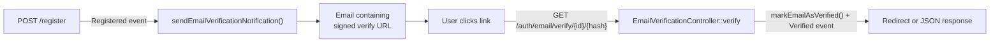

# Email Verification

Signed-URL email verification with optional login enforcement and OTP auto-verify.

## Flow



OTP verification (`/auth/{app,web}/otp/verify`) **also** marks the email as verified — the user just proved they own the address.

## Endpoints

| Method | Path | Auth | Description |
|---|---|---|---|
| `GET` | `/api/v1/auth/email/verify/{id}/{hash}` | Signed URL only (no auth) | Verify the email address. |
| `POST` | `/api/v1/auth/email/verification-notification` | Required (Sanctum) | Resend the verification email. |

Verify is intentionally unauthenticated so users can click the link from an email on any device. Security comes from the signed URL plus the `sha1(email)` hash.

## Configuration

```php
'auth' => [
    'email_verification' => [
        'enabled' => env('AUTH_EMAIL_VERIFICATION_ENABLED', true),
        'required_for_login' => env('AUTH_EMAIL_VERIFICATION_REQUIRED_FOR_LOGIN', false),
        'expire_minutes' => env('AUTH_EMAIL_VERIFICATION_EXPIRE_MINUTES', 60),
        'redirect_url' => env('AUTH_EMAIL_VERIFICATION_REDIRECT_URL'),
    ],
],
```

| Key | Effect |
|---|---|
| `enabled` | When false, `sendEmailVerificationNotification()` is a no-op — no verification emails are sent on registration. |
| `required_for_login` | When true, password login refuses unverified accounts with 403. OTP login is unaffected since it auto-verifies. |
| `expire_minutes` | Validity window of the signed link. |
| `redirect_url` | Optional. When set, the verify endpoint redirects to `<url>?status=success` (or `?status=failure&reason=invalid` on bad hash) instead of returning JSON. |

## Behavior Summary

| Scenario | Result |
|---|---|
| Register with `enabled=true` | Verification email sent. |
| Register with `enabled=false` | No email sent. |
| User clicks valid signed link | Email verified, `Illuminate\Auth\Events\Verified` dispatched. |
| Tampered query string | 403 (Laravel's `signed` middleware rejects). |
| Wrong `hash` segment | 404 with `"Verification link is invalid."` |
| Expired link | 403 (`signed` middleware rejects). |
| Resend by unverified user | 200 + new email. |
| Resend by verified user | 200 with `"Email already verified."` (no email sent). |
| Resend without auth | 401. |
| Resend exceeded limit | 429 (`auth-email_verify_resend` limiter — see [rate limiting](rate-limiting.md)). |
| Password login by unverified user, `required_for_login=true` | 403 `"Email address has not been verified."` |
| Password login by unverified user, `required_for_login=false` | Allowed. |
| OTP verify (any user, verified or not) | Email marked verified. |

## Frontend Redirect

When `AUTH_EMAIL_VERIFICATION_REDIRECT_URL=https://app.example.com/verified` is set, after a click the user lands on:

- `https://app.example.com/verified?status=success`
- `https://app.example.com/verified?status=failure&reason=invalid` (wrong hash)

Your frontend reads the query string and renders the right state. Without a redirect URL, the verify endpoint returns JSON — fine for API-only setups but a poor UX for browser clicks.

## Customizing the Email

The mailable is `App\Mail\VerifyEmail` with view `resources/views/emails/verify-email.blade.php`. Edit the Blade for branding/wording, or replace the mailable entirely if you'd rather use a Notification class.

## Usage Examples

### Resend

```bash
curl -X POST http://localhost/api/v1/auth/email/verification-notification \
  -H "Authorization: Bearer your-token"
```

### Manually Generate a Verify URL (e.g. in a test)

```php
use Illuminate\Support\Carbon;
use Illuminate\Support\Facades\URL;

$url = URL::temporarySignedRoute(
    'verification.verify',
    Carbon::now()->addMinutes(60),
    ['id' => $user->getKey(), 'hash' => sha1($user->getEmailForVerification())],
);
```

## Key Files

| File | Purpose |
|---|---|
| `app/Models/User.php` | Implements `MustVerifyEmail`; overrides `sendEmailVerificationNotification()`. |
| `app/Mail/VerifyEmail.php` | Mailable. |
| `resources/views/emails/verify-email.blade.php` | Email template. |
| `app/Http/Controllers/Api/Auth/EmailVerificationController.php` | Verify + resend endpoints. |
| `routes/api.php` | `/auth/email/verify/{id}/{hash}` and resend routes. |
| `config/boilerplate.php` → `auth.email_verification` | All knobs. |
