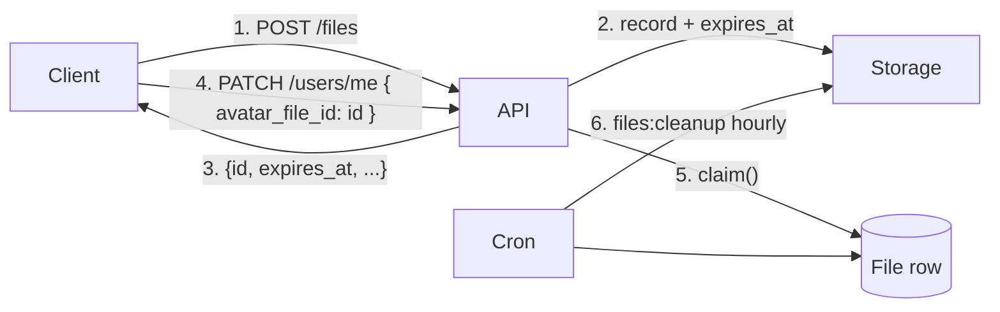

# File Uploads

A two-phase upload module with TTL-based cleanup. Built for headless API
clients that upload first, then commit the file id to a parent record.
Defaults to private visibility and the `local` disk; works unchanged with
`s3` or any other Laravel filesystem.

## How It Works



1. Client uploads → API returns a record with `expires_at` set in the future.
2. Client persists the id on a parent record (e.g. `user.avatar_file_id`).
3. The application calls `FileService::claim($id)` to clear `expires_at`,
   marking the file as persistent.
4. Files left unclaimed past their TTL are deleted by `php artisan files:cleanup`.

## Defaults

| | |
|---|---|
| Disk | `local` (override to `s3` for production) |
| Visibility | `private` |
| TTL | 24 hours (`1440` minutes) |
| Anonymous upload | disabled |
| Max size | 10 MB |
| Mime / extension allow-list | none (allow all) |
| Cleanup schedule | hourly |
| Authenticated rate limit | 60 / minute |
| Anonymous rate limit | 5 / 5 minutes |

## Configuration

`config/boilerplate.php → files`:

```php
'files' => [
    'enabled' => (bool) env('FILES_ENABLED', true),

    'disk' => env('FILES_DISK', 'local'),
    'visibility' => env('FILES_DEFAULT_VISIBILITY', 'private'),
    'path_template' => env('FILES_PATH_TEMPLATE', 'uploads/{Y}/{m}'),

    'allow_anonymous_upload' => (bool) env('FILES_ALLOW_ANONYMOUS_UPLOAD', false),
    'default_expires_after_minutes' => (int) env('FILES_DEFAULT_EXPIRES_AFTER_MINUTES', 1440),

    'max_size_kb' => (int) env('FILES_MAX_SIZE_KB', 10240),
    'allowed_mime_types' => null,   // null = allow all
    'allowed_extensions' => null,   // null = allow all

    'cleanup' => [
        'enabled' => (bool) env('FILES_CLEANUP_ENABLED', true),
        'chunk_size' => (int) env('FILES_CLEANUP_CHUNK_SIZE', 100),
    ],

    'rate_limit' => [
        'enabled' => (bool) env('FILES_RATE_LIMIT_ENABLED', true),
        'authenticated' => ['max' => 60, 'per_minutes' => 1],
        'anonymous' => ['max' => 5, 'per_minutes' => 5],
    ],
],
```

| Key | Effect |
|---|---|
| `enabled = false` | All file routes return 404. |
| `disk` | Any `config/filesystems.php` disk. Use `s3` for production. |
| `visibility` | Default upload visibility. Per-upload override via `visibility` body param. |
| `path_template` | `{Y}` `{m}` `{d}` tokens resolved at upload time. ULID + extension is appended for the filename. |
| `allow_anonymous_upload` | When true, the upload endpoint is reachable without auth and rate-limited tighter. |
| `default_expires_after_minutes` | Set to `0` to skip TTL entirely. |
| `allowed_mime_types` / `allowed_extensions` | Pass an array to allow-list; `null` allows everything. |

## Endpoints

All routes live under `/api/v1/files`.

| Method | Endpoint | Auth | Description |
|---|---|---|---|
| POST | `/files` | optional* | Upload a file; returns `{ id, expires_at, ... }`. |
| GET | `/files/{file}` | required | Fetch metadata. Uploader-only for private files. |
| GET | `/files/{file}/download` | required | Stream the file. Uploader-only for private; any authed user for public. |
| DELETE | `/files/{file}` | required | Soft-delete the record and remove from disk. |

\* Anonymous uploads are accepted only when `allow_anonymous_upload` is true.
Anonymously uploaded files are write-only over HTTP — the metadata/download/delete
endpoints all require auth and an uploader match. Use `FileService` server-side
to operate on them.

### Upload (curl)

```bash
curl -X POST http://localhost/api/v1/files \
  -H "Authorization: Bearer <token>" \
  -F "file=@/path/to/photo.jpg" \
  -F "visibility=private" \
  -F 'meta[source]=ios'
```

```json
{
  "data": {
    "id": "01HXABCD...",
    "client_name": "photo.jpg",
    "mime_type": "image/jpeg",
    "size": 248123,
    "visibility": "private",
    "is_claimed": false,
    "expires_at": "2026-05-11T05:00:00+00:00",
    "download_url": "http://localhost/api/v1/files/01HXABCD.../download"
  }
}
```

## Claim / Release

The TTL gives the client time to commit the file id somewhere persistent.
When you do, call `claim()` to remove the TTL.

### On the model

```php
$file->claim();   // expires_at = null
$file->release(); // expires_at = now() + default_expires_after_minutes
$file->release(60); // explicit override
$file->isClaimed(); // bool
$file->isExpired(); // bool
```

### Via the service

```php
use App\Services\Files\FileService;

$files = app(FileService::class);

$files->claim('01HX...');                          // accept ULID or model
$files->claimMany(['01H...', '01H...', $model]);  // bulk
$files->release($file);                            // re-attach TTL
$files->delete($file);                             // disk + soft delete
```

### Typical controller flow

```php
public function updateAvatar(UpdateAvatarRequest $request): JsonResponse
{
    $files = app(FileService::class);

    $newFile = $files->claim($request->validated('avatar_file_id'));

    if ($oldId = $request->user()->avatar_file_id) {
        $files->release($oldId); // mark for cleanup; cron handles removal
    }

    $request->user()->update(['avatar_file_id' => $newFile->id]);

    return $this->respondOk(new UserResource($request->user()));
}
```

## Cleanup

```bash
php artisan files:cleanup            # delete expired
php artisan files:cleanup --dry-run  # list what would be deleted
```

Scheduled hourly via `routes/console.php` when
`boilerplate.files.cleanup.enabled` is true. The command:

1. Scans `files` rows (including soft-deleted) where `expires_at <= now()`.
2. Deletes the file from disk (idempotent — missing files are skipped silently).
3. `forceDelete()`s the model row.

Claimed (`expires_at = null`) files are never touched.

## S3 / Other Object Storage

Add a disk to `config/filesystems.php`:

```php
's3' => [
    'driver' => 's3',
    'key' => env('AWS_ACCESS_KEY_ID'),
    'secret' => env('AWS_SECRET_ACCESS_KEY'),
    'region' => env('AWS_DEFAULT_REGION'),
    'bucket' => env('AWS_BUCKET'),
    // ...
],
```

Then set `FILES_DISK=s3` in `.env`. `Storage::download()` proxies the file
through your app — that's safe and simple but bypasses CDN caching. For
direct-to-S3 distribution, customize `FileController::download()` to return
a `Storage::temporaryUrl(...)` redirect when the disk supports it.

## Schema

`files` table:

| Column | Type | Notes |
|---|---|---|
| `id` | ULID | Primary key, public identifier |
| `disk` | string | Filesystem disk name |
| `path` | string | Path within the disk |
| `client_name` | string | Original filename from upload |
| `mime_type` | string | |
| `extension` | string nullable | |
| `size` | unsigned bigint | bytes |
| `checksum` | string nullable | sha256 (extension point) |
| `visibility` | string | `public` / `private` |
| `uploader_type`, `uploader_id` | nullable ULID morphs | Polymorphic uploader |
| `meta` | json nullable | Free-form extension point |
| `expires_at` | timestamp nullable | null = claimed (persistent) |
| `created_at` / `updated_at` | | |
| `deleted_at` | timestamp nullable | Soft delete |

Indexes follow the project naming convention.

## Customizing

| What | How |
|---|---|
| Disk per upload | Override `FileService::store()` or pass `disk` in `attributes`. |
| Image dimensions / thumbnails | Compute in a queued listener, store in `meta`. |
| Public CDN URLs | Return `Storage::url($file->path)` in `FileResource` for `disk=s3`. |
| Authorization rules | Edit `FileController::authorizeRead/authorizeOwn`; add Laratrust `permission` middleware as needed (see [rbac.md](rbac.md)). |
| Validation | `App\Http\Requests\Files\UploadFileRequest` reads from config; override per-project. |

## Key Files

| File | Purpose |
|---|---|
| `config/boilerplate.php → files` | Defaults and toggles. |
| `app/Models/File.php` | Eloquent model with `claim()` / `release()` helpers. |
| `app/Services/Files/FileService.php` | Storage, claim, release, delete. |
| `app/Http/Controllers/Api/FileController.php` | Upload / show / download / destroy. |
| `app/Http/Requests/Files/UploadFileRequest.php` | Validation. |
| `app/Http/Resources/FileResource.php` | API envelope. |
| `app/Console/Commands/CleanupExpiredFiles.php` | `files:cleanup` artisan command. |
| `database/migrations/*_create_files_table.php` | Schema. |
| `routes/console.php` | Hourly schedule for cleanup. |
