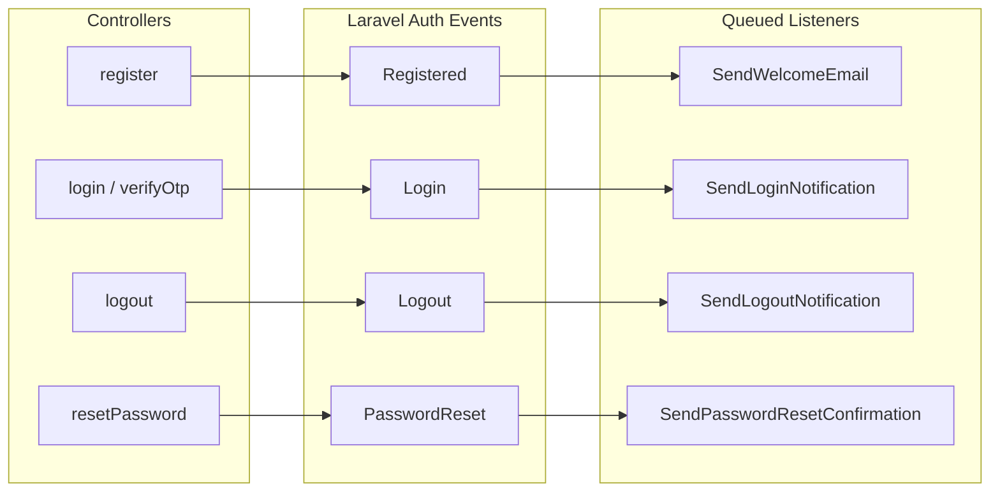

# Auth Event Notifications

Email notifications attached to Laravel's built-in auth events. Each one is queued and individually toggleable via config — turn on what your project needs.

## Supported Events

| Event | Listener | Email |
|---|---|---|
| `Illuminate\Auth\Events\Registered` | `SendWelcomeEmail` | Welcome email to new users |
| `Illuminate\Auth\Events\Login` | `SendLoginNotification` | Login alert |
| `Illuminate\Auth\Events\Logout` | `SendLogoutNotification` | Logout notification |
| `Illuminate\Auth\Events\PasswordReset` | `SendPasswordResetConfirmation` | Password change confirmation |
| `Illuminate\Auth\Events\Verified` | (none — wire your own as needed) | — |

OTP verification dispatches `Registered` for first-time users (so the welcome email fires) followed by `Login` (so the login alert fires).

## Configuration

```php
'auth' => [
    'notifications' => [
        'welcome_email_enabled' => env('AUTH_WELCOME_EMAIL_ENABLED', true),
        'login_notification_enabled' => env('AUTH_LOGIN_NOTIFICATION_ENABLED', true),
        'logout_notification_enabled' => env('AUTH_LOGOUT_NOTIFICATION_ENABLED', false),
        'password_reset_confirmation_enabled' => env('AUTH_PASSWORD_RESET_CONFIRMATION_ENABLED', true),
    ],
],
```

Each listener checks its flag at the start of `handle()`, so toggling at runtime takes effect for the next dispatched event without rebooting.

## Event Flow



## Customizing Email Templates

Templates live in `resources/views/emails/`:

| Template | Used by |
|---|---|
| `welcome.blade.php` | `SendWelcomeEmail` |
| `login-notification.blade.php` | `SendLoginNotification` |
| `logout-notification.blade.php` | `SendLogoutNotification` |
| `password-reset-confirmation.blade.php` | `SendPasswordResetConfirmation` |
| `password-reset.blade.php` | Password reset link email |
| `login-otp.blade.php` | OTP code email |
| `verify-email.blade.php` | Email verification link |

Edit Blade for branding/wording, or swap the mailable for a Notification class if you need DB / Slack / SMS channels.

## Adding a New Event Listener

1. Create the listener:
   ```bash
   php artisan make:listener SendCustomNotification
   ```
2. Implement `handle()` with a config gate:
   ```php
   public function handle(MyEvent $event): void
   {
       if (! config('boilerplate.auth.notifications.my_thing_enabled', false)) {
           return;
       }
       Mail::to($event->user)->send(new MyMail);
   }
   ```
3. Listeners in `app/Listeners/` are auto-discovered in Laravel 12 — no manual registration needed.

## Key Points

| | |
|---|---|
| **Queued** | Every listener implements `ShouldQueue`. With `QUEUE_CONNECTION=sync` (the default for tests) they run synchronously; in prod, run a queue worker. |
| **Idempotent** | Listeners check config; running twice is harmless. |
| **OTP cascade** | OTP verify dispatches `Registered` for new users, then `Login` — both listener chains fire. |
| **Discovery** | `app/Listeners/*.php` auto-registered. Keep new listeners there. |

## Key Files

| File | Purpose |
|---|---|
| `app/Listeners/SendWelcomeEmail.php` | Welcome email listener |
| `app/Listeners/SendLoginNotification.php` | Login notification listener |
| `app/Listeners/SendLogoutNotification.php` | Logout notification listener |
| `app/Listeners/SendPasswordResetConfirmation.php` | Password reset confirmation listener |
| `app/Mail/*.php` | Mailables |
| `resources/views/emails/*.blade.php` | Email templates |
