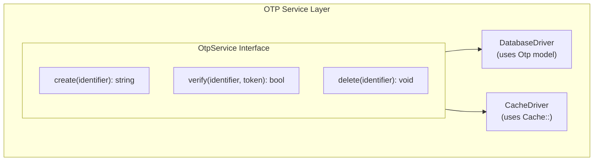

# One-Time Password (OTP)

Email-based passwordless authentication. The user requests a code, receives it by email, and exchanges it for a session/token. New users are auto-created on first verify.

## Why a Driver Abstraction

OTP storage is fronted by `App\Services\Otp\Contracts\OtpService` with two interchangeable drivers — pick whichever fits your infrastructure without touching the rest of the auth code.

### Database Driver (default)

Stores OTPs in the `otps` table. Best for:
- Simple deployments without Redis
- Auditing OTP records
- Local development

```bash
OTP_DRIVER=database
```

### Cache Driver

Stores OTPs in Laravel's cache (Redis, Memcached, …). Best for:
- High-throughput production
- Existing Redis stack
- Automatic TTL-based expiration (no cleanup job needed)

```bash
OTP_DRIVER=cache
OTP_CACHE_STORE=redis
```

## Architecture



## Configuration

```php
'auth' => [
    'otp_auth_enabled' => true,
    'otp_length' => 6,
    'otp_expiry_minutes' => 10,
    'otp_driver' => env('OTP_DRIVER', 'database'),
    'otp_cache_store' => env('OTP_CACHE_STORE'),
],
```

## Endpoints

| Method | Path | Auth | Description |
|---|---|---|---|
| `POST` | `/api/v1/auth/{app,web}/otp` | No | Send a 6-digit code to the email. |
| `POST` | `/api/v1/auth/{app,web}/otp/verify` | No | Exchange the code for a token (app) or session (web). |

Both endpoints are throttled by [auth rate limits](rate-limiting.md): `auth-otp_issue` and `auth-otp_verify`.

## Verify Side-Effects

A successful OTP verify:
1. Creates the user account if the email isn't registered (dispatches `Registered` event).
2. Marks the email as verified — see [email verification](email-verification.md). OTP delivery already proves email ownership, so we trust it.
3. Updates `last_login_at`.
4. Dispatches `Login` event.
5. Issues a Sanctum token (app) or Auth::login (web).

## Usage

### Request OTP

```bash
curl -X POST http://localhost/api/v1/auth/app/otp \
  -H "Content-Type: application/json" \
  -d '{"email": "john@example.com"}'
```

### Verify OTP

```bash
curl -X POST http://localhost/api/v1/auth/app/otp/verify \
  -H "Content-Type: application/json" \
  -d '{
    "email": "john@example.com",
    "token": "123456",
    "device_name": "iPhone 15 Pro"
  }'
```

## OTPs Table

| Column | Type | Description |
|---|---|---|
| `id` | bigint | Primary key |
| `identifier` | string | Email address |
| `token` | string | OTP code |
| `expires_at` | timestamp | Expiration |
| `created_at` / `updated_at` | timestamp | Timestamps |

## Key Files

| File | Purpose |
|---|---|
| `app/Services/Otp/Contracts/OtpService.php` | Service interface |
| `app/Services/Otp/DatabaseDriver.php` | Database storage driver |
| `app/Services/Otp/CacheDriver.php` | Cache storage driver |
| `app/Providers/OtpServiceProvider.php` | Driver binding from config |
| `app/Models/Otp.php` | Eloquent model (database driver only) |
| `app/Mail/LoginOtp.php` | Email mailable |
| `resources/views/emails/login-otp.blade.php` | Email template |
