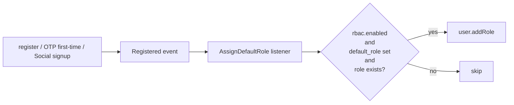

# RBAC (Roles & Permissions)

Role-based access control via [Laratrust](https://laratrust.santigarcor.me/) v8. Defaults are seeded from `config/boilerplate.php`, new users are auto-assigned a role on registration, and the standard `role:` / `permission:` route middleware integrate with our [JSON exception envelope](api-responses.md).

## Defaults Out of the Box

| | |
|---|---|
| Roles | `admin`, `user` |
| Default role on register | `user` |
| Permissions | `users.read`, `users.write`, `roles.read`, `roles.write` |
| `admin` permissions | `*` (all) |
| `user` permissions | (none) |

These are starting points — edit `config/boilerplate.php` for your project's domain.

## Configuration

```php
'rbac' => [
    'enabled' => (bool) env('RBAC_ENABLED', true),
    'default_role' => env('RBAC_DEFAULT_ROLE', 'user'),

    'permissions' => [
        ['name' => 'users.read',  'display_name' => 'View Users',   'description' => '...'],
        ['name' => 'users.write', 'display_name' => 'Manage Users', 'description' => '...'],
        // ...
    ],

    'roles' => [
        [
            'name' => 'admin',
            'display_name' => 'Administrator',
            'description' => 'Full access.',
            'permissions' => ['*'],
        ],
        [
            'name' => 'user',
            'display_name' => 'User',
            'description' => 'Standard user.',
            'permissions' => [],
        ],
    ],
],
```

| Key | Effect |
|---|---|
| `enabled = false` | Seeder is a no-op, registration does not auto-assign, listener short-circuits. |
| `default_role = null` | Disable auto-assignment without disabling RBAC. |
| `permissions[].name` | Use `action.resource` (e.g. `posts.publish`). The seeder upserts by name. |
| `roles[].permissions` | List permission names; `['*']` grants every permission in the config. |

## Behavior Matrix

| `rbac.enabled` | `default_role` set | Outcome on register |
|---|---|---|
| true | `'user'` (default) | Role `user` attached after `Registered` event fires. |
| true | `null` | User created, no role attached. |
| false | any | Listener short-circuits; behaves as if RBAC is off. |

The role must exist when assignment runs. If the configured `default_role` is missing from the database, the listener logs a warning and skips — registration still succeeds.

## Seeder

`Database\Seeders\RolesAndPermissionsSeeder` upserts roles and permissions, then syncs each role's permission list. Idempotent — safe to run on every deploy.

```bash
php artisan db:seed --class=RolesAndPermissionsSeeder
```

It is also called by the default `DatabaseSeeder`, so `php artisan migrate --seed` covers a fresh install.

## Route Middleware

Laratrust auto-registers three aliases. Use them on routes the same way you'd use `auth`:

```php
// Single role
Route::middleware(['auth:sanctum', 'role:admin'])->get('/admin/users', ...);

// Single permission
Route::middleware(['auth:sanctum', 'permission:users.write'])->post('/users', ...);

// Any of multiple roles (OR)
Route::middleware(['auth:sanctum', 'role:admin|editor'])->get('/dashboard', ...);

// All of multiple permissions (AND) — append `|require_all`
Route::middleware(['auth:sanctum', 'permission:users.read|users.write|require_all'])->put('/users/{id}', ...);

// Custom ability (combines roles and permissions)
Route::middleware(['auth:sanctum', 'ability:admin,users.write'])->delete('/users/{id}', ...);
```

A failed check raises `HttpException(403)`, which is rendered as our standard JSON envelope:

```json
{ "message": "User does not have any of the necessary access rights." }
```

## Programmatic Checks

```php
$user->hasRole('admin');                  // bool
$user->hasRole('admin|editor');           // bool — any of these (OR)
$user->isAbleTo('users.write');           // bool — has permission directly or via role
$user->doesntHavePermission('users.write'); // bool

$user->addRole('admin');
$user->removeRole('admin');
$user->syncRoles(['user', 'editor']);

$user->givePermission('users.write');     // direct permission grant (bypasses roles)
$user->syncPermissions([$perm1, $perm2]); // direct grants
```

See [Laratrust docs](https://laratrust.santigarcor.me/docs/8.x/usage/concepts) for the complete API.

## Default-Role Assignment Flow



The listener runs **synchronously** (not queued) so the role is attached before the registration response is returned. Welcome email and other queued listeners on the same event are unaffected.

## Tables

`laratrust_setup_tables` migration creates:

| Table | Purpose |
|---|---|
| `roles` | Role definitions (`name`, `display_name`, `description`). Unique on `name`. |
| `permissions` | Permission definitions. Unique on `name`. |
| `role_user` | Polymorphic role assignments (`user_id`, `role_id`, `user_type`). |
| `permission_user` | Direct permission grants to users. |
| `permission_role` | Permissions belonging to a role. |

Indexes follow the project naming convention (`uq_*`, `pk_*`, `fk_*`, `idx_*`).

## Adding a Role or Permission

1. Add to `config/boilerplate.php`:
   ```php
   'permissions' => [
       // ...
       ['name' => 'posts.publish', 'display_name' => 'Publish Posts'],
   ],
   'roles' => [
       // ...
       [
           'name' => 'editor',
           'display_name' => 'Editor',
           'permissions' => ['posts.publish', 'users.read'],
       ],
   ],
   ```
2. Re-run the seeder:
   ```bash
   php artisan db:seed --class=RolesAndPermissionsSeeder
   ```

The seeder is `updateOrCreate` + `syncPermissions`, so adding/removing permissions on a role is reflected on the next run.

## Cache

Laratrust caches role/permission lookups when `LARATRUST_ENABLE_CACHE=true` (default in production). Tests use `CACHE_STORE=array`, so caching is effectively per-request. After mutating roles/permissions in production, call `$user->flushCache()` or invalidate cache via your usual mechanism.

## Key Files

| File | Purpose |
|---|---|
| `config/boilerplate.php` → `rbac` | Defaults and toggles. |
| `config/laratrust.php` | Laratrust internals (models, tables, middleware behavior). |
| `app/Models/User.php` | Implements `LaratrustUser` and uses `HasRolesAndPermissions`. |
| `app/Models/Role.php` / `Permission.php` | Thin app-namespace wrappers. |
| `database/seeders/RolesAndPermissionsSeeder.php` | Idempotent role/permission seeder. |
| `app/Listeners/AssignDefaultRole.php` | Assigns default role on `Registered`. |
| `database/migrations/*_laratrust_setup_tables.php` | RBAC schema. |
