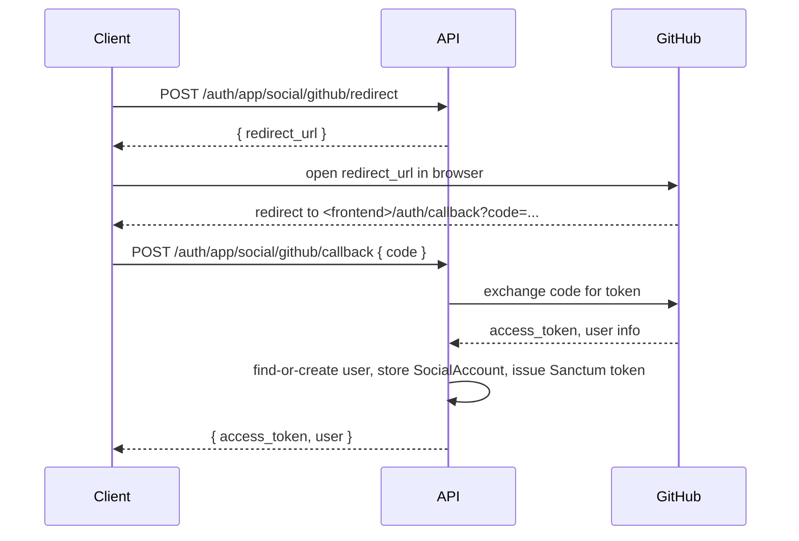

# Social Authentication (OAuth)

OAuth login and account linking via [Laravel Socialite](https://laravel.com/docs/socialite). Available for both token-based (`/auth/app/social/...`) and cookie-based (`/auth/web/social/...`) flows.

## Built-in Providers

Google, GitHub, Facebook, Twitter — each individually toggleable. Adding more providers (LinkedIn, Apple, …) is a config + env var change.

## Configuration

```php
'auth' => [
    'socialite_enabled' => env('SOCIALITE_ENABLED', true),
    'socialite_providers' => [
        'google' => env('SOCIALITE_GOOGLE_ENABLED', false),
        'github' => env('SOCIALITE_GITHUB_ENABLED', false),
        'facebook' => env('SOCIALITE_FACEBOOK_ENABLED', false),
        'twitter' => env('SOCIALITE_TWITTER_ENABLED', false),
    ],
    'socialite_callback_url' => env('SOCIALITE_CALLBACK_URL', 'http://localhost:3000/auth/callback'),
],
```

Provider credentials live in `config/services.php` (already wired to env vars per provider).

## Endpoints

For both `app` and `web`:

| Method | Path | Auth | Description |
|---|---|---|---|
| `POST` | `/social/{provider}/redirect` | No | Get the OAuth redirect URL. |
| `POST` | `/social/{provider}/callback` | No | Exchange code for token, log the user in. |
| `GET` | `/social/accounts` | Yes | List linked accounts for the current user. |
| `POST` | `/social/{provider}/link` | Yes | Start the link flow for the current user. |
| `POST` | `/social/{provider}/link/callback` | Yes | Complete linking. |
| `DELETE` | `/social/{provider}/unlink` | Yes | Unlink. |

All four `redirect/callback/link/link-callback` endpoints share the [`auth-social` rate limiter](rate-limiting.md).

## OAuth Flow



## Usage

### Login with GitHub (App / Token-based)

```bash
# 1. Get redirect URL
curl -X POST http://localhost/api/v1/auth/app/social/github/redirect

# {
#   "data": { "redirect_url": "https://github.com/login/oauth/authorize?..." }
# }

# 2. Open the URL in browser; GitHub redirects to <frontend>/auth/callback?code=ABC

# 3. Exchange code for token
curl -X POST http://localhost/api/v1/auth/app/social/github/callback \
  -H "Content-Type: application/json" \
  -d '{ "code": "ABC", "device_name": "iPhone 15 Pro" }'
```

### Link a Provider to an Existing Account

```bash
# 1. Begin link flow
curl -X POST http://localhost/api/v1/auth/app/social/github/link \
  -H "Authorization: Bearer your-token"

# 2. Complete after OAuth
curl -X POST http://localhost/api/v1/auth/app/social/github/link/callback \
  -H "Authorization: Bearer your-token" \
  -H "Content-Type: application/json" \
  -d '{ "code": "ABC" }'
```

### Unlink

```bash
curl -X DELETE http://localhost/api/v1/auth/app/social/github/unlink \
  -H "Authorization: Bearer your-token"
```

### Web (Cookie-based)

Same paths under `/auth/web/social/...`. Use `credentials: 'include'` from your SPA. The callback establishes a session cookie instead of returning a token.

## Auto-Linking by Email

When the OAuth callback returns a user with an email that matches an existing local account, we automatically attach the social account to that user — no extra confirmation step. If you'd prefer explicit confirmation (to mitigate account takeover via OAuth provider compromise), edit `App\Http\Controllers\Api\Auth\Concerns\HandlesSocialiteAuth::findOrCreateUser`.

## Social Accounts Table

| Column | Type | Description |
|---|---|---|
| `id` | bigint | Primary key |
| `user_id` | bigint | FK → users |
| `provider` | string | `google`, `github`, … |
| `provider_id` | string | Unique ID from provider |
| `provider_email` | string | Email reported by provider |
| `name` | string | Display name |
| `avatar` | string | Avatar URL |
| `access_token` | text | Encrypted OAuth access token |
| `refresh_token` | text | Encrypted OAuth refresh token |
| `token_expires_at` | timestamp | Token expiration |
| `created_at` / `updated_at` | timestamp | Timestamps |

OAuth tokens are encrypted at rest via Laravel's encrypter.

## Adding a New Provider

1. Toggle in `config/boilerplate.php`:
   ```php
   'socialite_providers' => [
       // ...
       'linkedin' => env('SOCIALITE_LINKEDIN_ENABLED', false),
   ],
   ```
2. Add credentials to `config/services.php`:
   ```php
   'linkedin' => [
       'client_id' => env('LINKEDIN_CLIENT_ID'),
       'client_secret' => env('LINKEDIN_CLIENT_SECRET'),
       'redirect' => env('LINKEDIN_REDIRECT_URI'),
   ],
   ```
3. Set the env vars.

If Socialite doesn't ship a built-in driver for the provider, install one of the community packages from [socialiteproviders.com](https://socialiteproviders.com).

## Environment Variables

```bash
SOCIALITE_ENABLED=true
SOCIALITE_CALLBACK_URL=http://localhost:3000/auth/callback

SOCIALITE_GOOGLE_ENABLED=true
GOOGLE_CLIENT_ID=...
GOOGLE_CLIENT_SECRET=...
GOOGLE_REDIRECT_URI=http://localhost:3000/auth/callback/google

SOCIALITE_GITHUB_ENABLED=true
GITHUB_CLIENT_ID=...
GITHUB_CLIENT_SECRET=...
GITHUB_REDIRECT_URI=http://localhost:3000/auth/callback/github

# Facebook / Twitter follow the same SOCIALITE_<PROVIDER>_* pattern.
```

## Key Files

| File | Purpose |
|---|---|
| `app/Http/Controllers/Api/Auth/AppSocialAuthController.php` | Token-based social auth |
| `app/Http/Controllers/Api/Auth/WebSocialAuthController.php` | Cookie-based social auth |
| `app/Http/Controllers/Api/Auth/Concerns/HandlesSocialiteAuth.php` | Shared find-or-create + link/unlink logic |
| `app/Models/SocialAccount.php` | Social account model with token encryption |
| `app/Http/Requests/Auth/SocialCallbackRequest.php` | Code validation |
